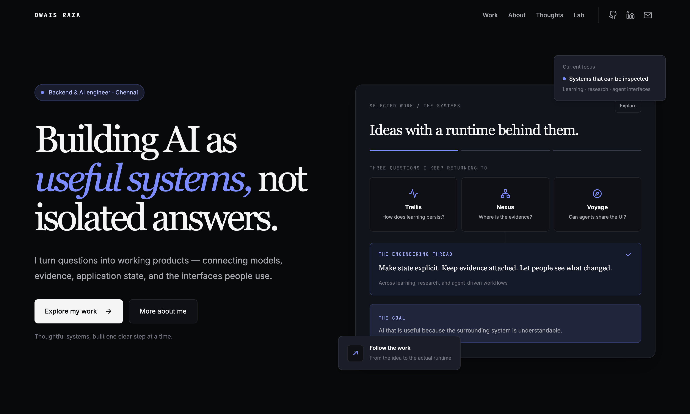

# Owais Raza

**Backend & AI engineer · Chennai, India**

I build AI as useful systems, not isolated answers. My work connects models with the less visible engineering around them: application state, retrieval, evidence, APIs, evaluation, and interfaces that let people understand what happened.

This portfolio is a record of the products, prototypes, and questions shaping that work. Some projects are working local systems; others are experiments still being developed. Their pages describe both the design and the current state.

## The questions behind the work

- How can a learning system preserve context and progress across a long journey?
- How can a research answer stay connected to the passage that supports it?
- How can an agent act inside an application while the person remains in control?
- How do we know a model or workflow improved when the whole task is measured?

These questions lead me across AI systems and backend engineering. I care about explicit state, inspectable evidence, and the full path from an idea to an experience someone can use.

## Explore the portfolio

**Work** contains case studies for the systems I am building. Each one explains the problem, the runtime path, core responsibilities, engineering questions, and current status.

**About** introduces my background, approach, and the areas I work in. I am a System Engineer at Tata Consultancy Services, and my independent projects give me room to explore the same engineering questions in public.

**Thoughts** collects field notes drawn from the work: why schema validity changed a fine-tuning decision, what a citation needs to preserve, and how a person and an agent can share one application state.

**Lab** holds smaller experiments and measured findings, including model evaluation, retrieval checks, agent execution, and explainable pipelines. It is where open questions stay visible.

The site also has a **Now** page for current focus and a **Contact** page for conversations about the work.

## Selected systems

| Project | What it explores |
| --- | --- |
| **Trellis** | A structured learning environment that keeps curriculum state, scoped AI help, exploration, and progress connected. |
| **Nexus** | A source-grounded research API that retrieves document passages, saves inspectable citations, and can say when context is insufficient. |
| **Cognia** | An experimental agent runtime with reasoning strategies, execution state, and checkpoints. |
| **Voyage** | A travel prototype where the normal interface and an agent operate the same trip state, with confirmation before simulated booking. |
| **Rezolve** | A live support concept focused on request state, single-winner claims, and the path from matching to a private room. |
| **AgentConfig Evaluation** | A Qwen3 fine-tuning experiment that measures structured-output validity and end-to-end usefulness before selecting a checkpoint. |

The common thread is simple: an AI feature becomes more useful when the system around it is clear enough to inspect, test, and trust.
